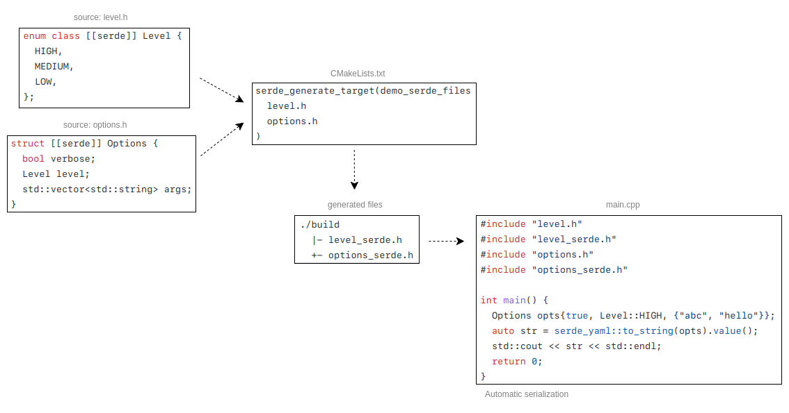

serde-cpp
===

> Not ready yet !!
> Currently in first stage of development !!
> Open to contributions!

Serialization framework for C++17, inspired on Rust's [serde](https://serde.rs/).

**serde-cpp** ultimate goal is to make C++ data structures _automatically_ serializable without using MACROS,
but rather with only valid C++17 syntax! That is, by using cpp's [[[_attributes_](https://en.cppreference.com/w/cpp/language/attributes)]],
and provide a single API for serializing data types to any data format (yaml, json, toml, ...), like serde does for Rust.

Example
---

```cpp
struct [[serde]]
Point {
  int x;
  int y;
};

int main() {
  Point point{ 10, 20 };
  std::string serialized = serde_yaml::to_string(point).value();
  std::cout << serialized << std::endl;
  Point deserialized = serde_yaml::from_str<Point>("x: 10\ny: 20\n").value();
  assert(point.x == deserialized.x && point.y == deserialized.y);
}
```

No macros, no duplicate description of the struct's fields, nothing else.. only [[serde]] attribute needed.

How we do it
---

**serde-cpp** generates serialization code for each header or translation unit passed to the serde generator binary.
_serde_gen_ will scan the input file for types that have [[serde]] attributes applied and generate the serialization and deserialization code
using serde-cpp's Serializer and Deserializer APIs.

For the example above, the generated code would look like this:

```cpp
template<>
void serde::serialize(serde::Serializer& ser, const Point& point)
{
  ser.serialize_struct_begin();
    ser.serialize_struct_field("x", point.x);
    ser.serialize_struct_field("y", point.y);
  ser.serialize_struct_end();
}

template<>
void serde::deserialize(serde::Deserializer& de, Point& point)
{
  de.deserialize_struct_begin();
    de.deserialize_struct_field("x", point.x);
    de.deserialize_struct_field("y", point.y);
  de.deserialize_struct_end();
}
```

More information will be provided here in the future.

Overview
---



Roadmap
---

- [x] Serializer interface
- [x] Deserializer interface
- [x] Builtin de/serializers
  - [x] yaml
  - [ ] json
  - [ ] toml
  - [ ] xml
- [x] Deserialize complex types (template types)
- [x] Serde for local scope and private user types
- [x] Builtin std types serialization 
  - [x] string, string\_view
  - [x] vector, array
  - [x] map, unordered\_map
  - [x] set, unordered\_set
  - [x] tuple, pair
  - [x] optional
  - [x] variant
  - [x] multiset, multimap
  - [x] unordered\_multiset, unordered\_multimap
  - [x] list, forward\_list
  - [x] stack, deque, queue, priority\_queue
  - [x] initializer\_list
- [x] Test std types serialization
- [x] Test builtin types serialization
- [x] De/Serialization for incomplete simple/template types (struct/class/enum)
- [ ] De/Serialization for specialized types
- [x] CMake exported function to generate serde files automatically
- [ ] Proper parsing/emitting error return
- [ ] Serde generation with attributes for user types
  - [ ] enum
  - [ ] struct (POD type)
  - [ ] forward-declarations
  - [ ] foreign-types
  - [ ] additional attributes (skip, skip\_de, skip\_ser, rename, getter, setter, flatten, skip\_none, default, ...)
- [ ] Validate serde calls (seq/map utils) at interface level before impl (protected virtual)
- [ ] Serde Union support
- [ ] Support non-default constructable types
- [ ] serde test suite
  - [ ] Invalid hierarchy (map/seq/struct..)
  - [ ] User Complex types
- [ ] serde\_attr test suite
  - [ ] Simple types
  - [ ] Template types
- [ ] serde\_yaml test suite
  - [ ] full api test
- [ ] CMake package
- [ ] Support wchar\_t and other CharT
